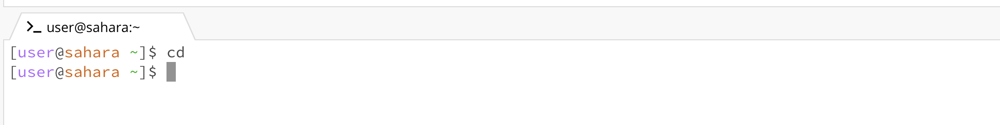
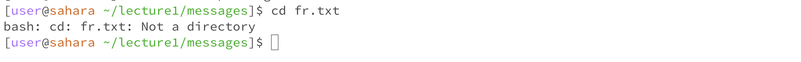

# Lab Report 1

# cd with nothing

Working directory: user@sahara ~
No change, because there was no directory provided. 

# cd with directory

Working directory before: user@sahara ~
working directory after: user@sahara ~/lecture1/messages

This changed folders to the subfolder messages, which is stored in the folder lecture1.
The leftmost folder name 'lecture1' is the enclosing folder, 'messages' is the folder inside 'lecture1'

# cd with file

Working directory: ~/lecture1/messages
