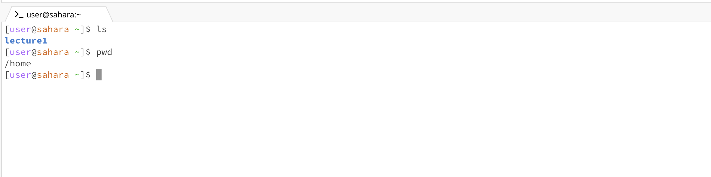
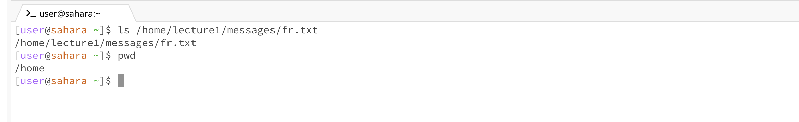
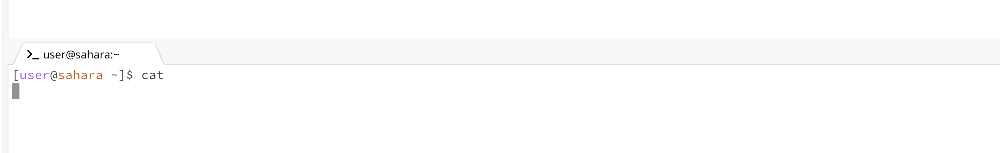
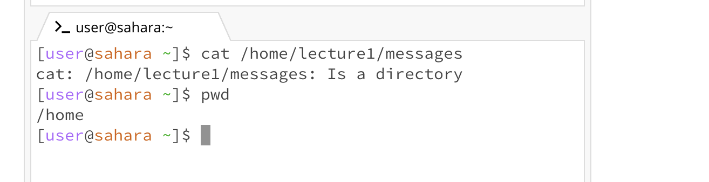
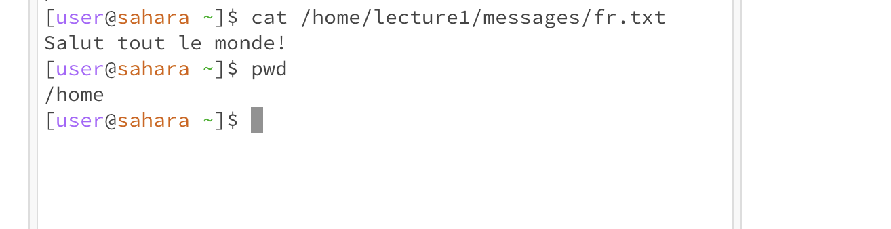

# Lab Report 1

# Part 1

Screenshot: `cd`  with nothing
1. What the working directory was when the command was run: `/home`
2. Why you I got that output: No change, because there was no directory provided.
3. Is the output is an error or not, and if it’s an error, why: This is not an error. No error message was returned, it just didn't switch directories because no directory was mentioned.

Screenshot: `cd` with directory
1. What the working directory was when the command was run: `/home` (before running command) `/home/lecture1/messages` (after running command)
2. Why you I got that output: I got this output because I specified that the I wanted to switch my directory to the folder messages, which is stored in the folder lecture1. This output indicates that the working directory was changed to the messages folder.
3. Is the output is an error or not, and if it’s an error, why: This is not an error. No error message was returned.

Screenshot: `cd` with file
1. What the working directory was when the command was run: `/home/lecture1/messages`
2. Why you I got that output: I got this output because I tried to `cd` into a file. The file is not a working directory, so it could not be opened. The `cd` command expects a folder path.
3. Is the output is an error or not, and if it’s an error, why: This is an error message. It's an error because the path provided is a file, not a folder path. The `cd` command expects a path, and will object if you do not give it one.

# Part 2

Screenshot: `ls` with nothing
1. What the working directory was when the command was run: `/home`
2. Why you I got that output: Since I am in the `/home` directory, I got the output listing the lecture1 folder, the only folder or file in the `/home` directory.
3. Is the output is an error or not, and if it’s an error, why: It is not an error, because it is doing the right function - it's just listing all the files and folder in the current directory.

Screenshot: `ls` with directory
1. What the working directory was when the command was run: `/home`
2. Why you I got that output: I got the output listing the names of the text files because the `ls` command was looking for all files in the directory inputted (`/home/lecture1/messages`). It found all the text files in the messages folder and printed their names.
3. Is the output is an error or not, and if it’s an error, why: This is not an error, it is the expected output. This is supposed to print the contents of the directory.
   

Screenshot: `ls` with file
1. What the working directory was when the command was run: `/home`
2. Why you I got that output: I got this output because there's a file in the directory, and it lists relevant information about the file, which in this case is its name.
3. Is the output is an error or not, and if it’s an error, why: It's not an error, it's just a short response because there's not much information about the file. If I wanted extra details, I'd use `ls -l fr.txt`

# Part 3

Screenshot: `cat` with nothing
1. What the working directory was when the command was run: `/home`
2. Why you I got that output: This output occurred because the `cat` command was looking for a file to concatenate. Since no file was found, it didn't print anything to standard output. When no file name is inputted, it will read standard input and print it to the output.
3. Is the output is an error or not, and if it’s an error, why: Not an error, since no file name was given. The terminal is confused and waiting for a file name to be typed in. It chooses to read input and print it to output.

Screenshot: `cat` with directory
1. What the working directory was when the command was run: `/home`
2. Why you I got that output: I got that output because the directory was not a file name. 
3. Is the output is an error or not, and if it’s an error, why: It's an error message. The `cat` command is looking for a file name, and the directory is not a file.
   

Screenshot: `cat` with file
1. What the working directory was when the command was run: `/home`
2. Why you I got that output: This `cat` command outputs the contents of a file. Since the file contents are `Salut tout le monde!`, that's what was printed out.
3. Is the output is an error or not, and if it’s an error, why: This is not an error. The `cat` command is supposed to print the output to the terminal.

