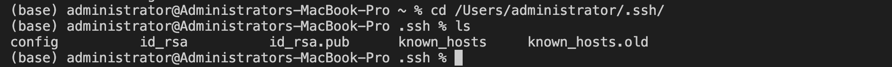

## Message 1

1. *Which methods in your code are called?* When the server is first started, the method public static void main(String args[]) is called. This calls the constructor StringHandler() and then it calls the method public String handleRequest(URI url) 

2. *What are the relevant arguments to those methods, and the values of any relevant fields of the class?*
The relevant argument to public static void main(String args[]) is the server number, which is taken from argos[0]
The relevant argument of handleRequest is the url, which is the url typed into the terminal. The url is http://localhost:4023/add-message?s=Hello

3. *How do the values of any relevant fields of the class change from this specific request? If no values got changed, explain why.*
This changes the value of private static String masterString from an empty string to the string “\n 1. Hello”.  The private static int index variable changes from 0 to 1. 

## Message 2

1. *Which methods in your code are called?* The method public String handleRequest(URI url) is called.
2. *What are the relevant arguments to those methods, and the values of any relevant fields of the class?* The relevant argument of handleRequest is the url, which is the url typed into the terminal. (http://localhost:4023/add-message?s=How%20are%20you)
3. *How do the values of any relevant fields of the class change from this specific request? If no values got changed, explain why.* This changes the value of private static String masterString from “\n 1. Hello” to  “\n 2. How are you”  The private static int index variable changes from 1 to 2. 

## Private Key

The path to the private key for your SSH key for logging into ieng6 (on your computer or on the home directory of the lab computer)

## Public Key

The path to the public key for your SSH key for logging into ieng6 (within your account on ieng6)
## No Password

A terminal interaction where you log into ieng6 with your course-specific account without being asked for a password.
