# Lab 4

# Step 4
Log into ieng6
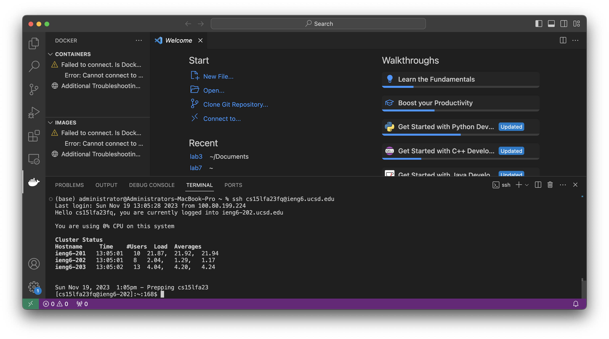
Keys pressed: `ssh cs15lfa23fq@ieng6.ucsd.edu`

# Step 5
Clone your fork of the repository from your Github account (using the SSH URL)
Copying from Github:
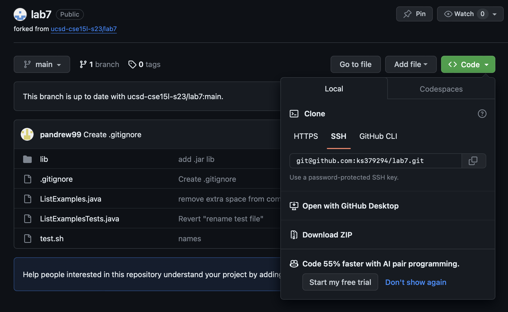
Using the command `git clone`:
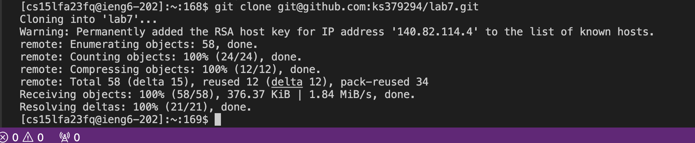

Keys pressed: `Command +C` to copy the ssh url. I typed `git clone` and then `Command + V` to paste the URL and then `<enter>`

# Step 6
Run the tests, demonstrating that they fail
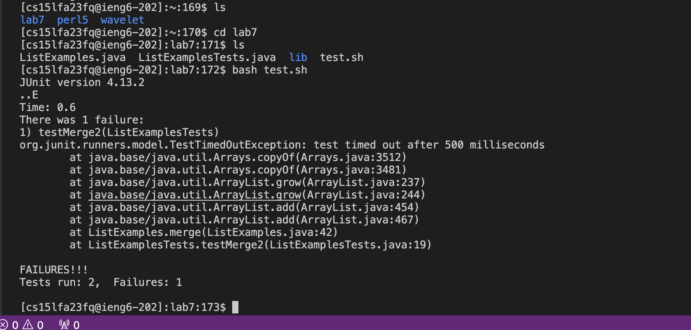

Keys Pressed: `ls` `<enter>` I used this to find where the lab folder was. `cd lab7`, `<enter>` to get into the `lab7` folder.
`ls` `<enter>` to find the test file. Then I ran the tests using `bash test.sh <enter>`

# Step 7
Edit the code file to fix the failing test
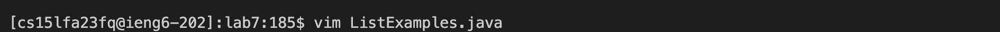
Keys pressed: `vim ListExamples.java` `<enter>` I used this to open up the file `ListExamples.java`
File before change:
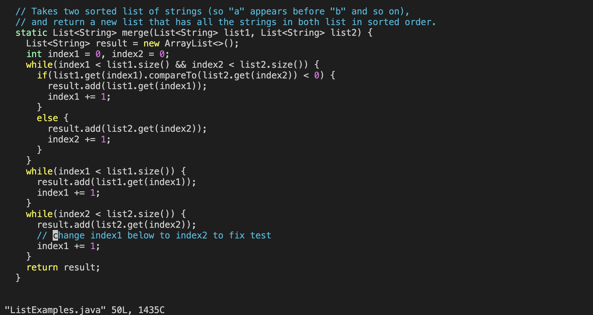

Then I pressed: `\change` to get to the error and pressed `<enter>` To modify the index number, I put this in: 
`<down><right><right>` to get to the number, then `control + a` to increment the number.
Then I saved this by pressing `:wq` `<enter>` to write the file and close `vim`.
File after change:
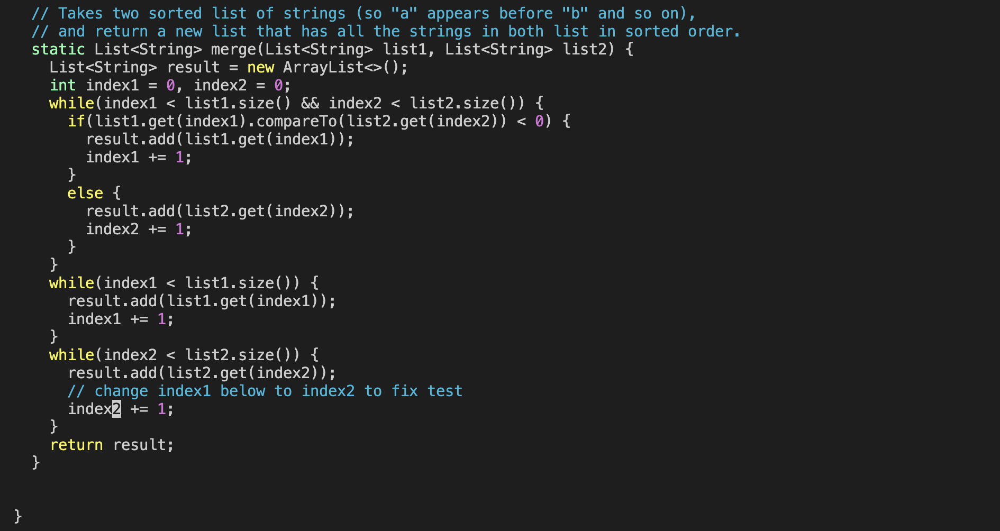

# Step 8
Run the tests, demonstrating that they now succeed
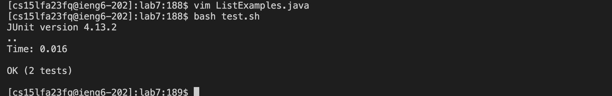
Keys pressed: I pressed `bash test.sh` `<enter>`

# Step 9
Commit and push the resulting change to your Github account (you can pick any commit message!)

Keys pressed: `git commit --all` `<enter>` This commits all changes
Initial command:

The message box opens up:
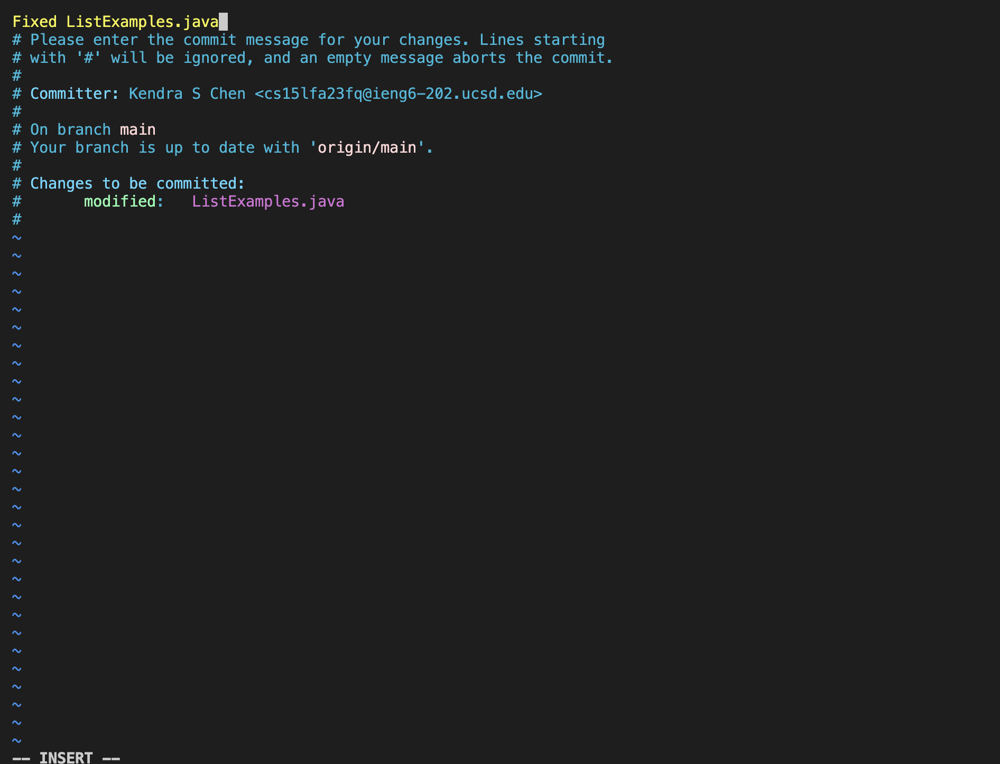

Keys pressed: `i` to enter `INSERT` mode, `Fixed ListExamples.java` as my message `ESC` to go into `NORMAL` mode, then `:wq` `<enter>` to save the message.
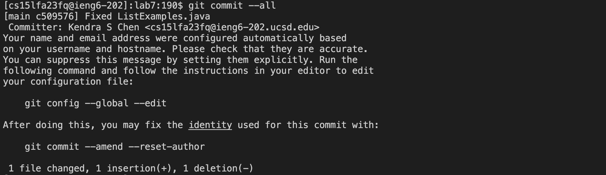
Keys pressed: `git push` `<enter>` to `push` changes to `main`.
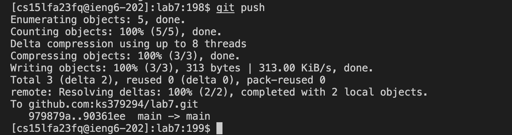

