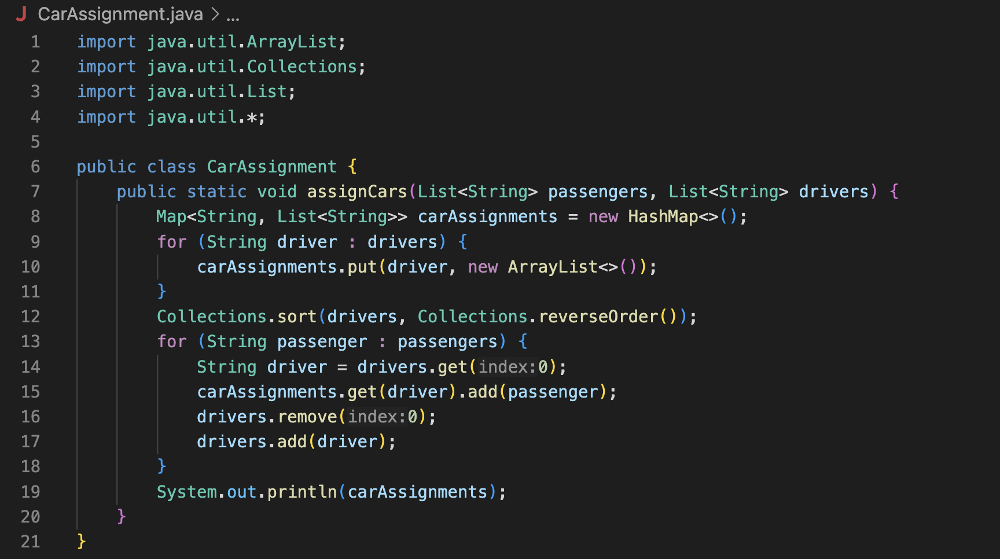
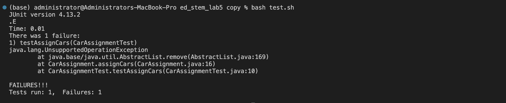
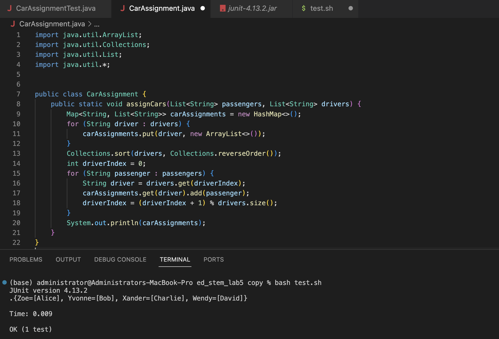
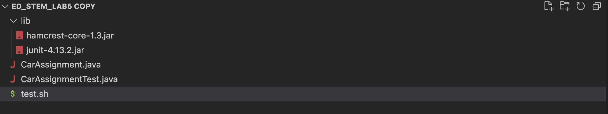
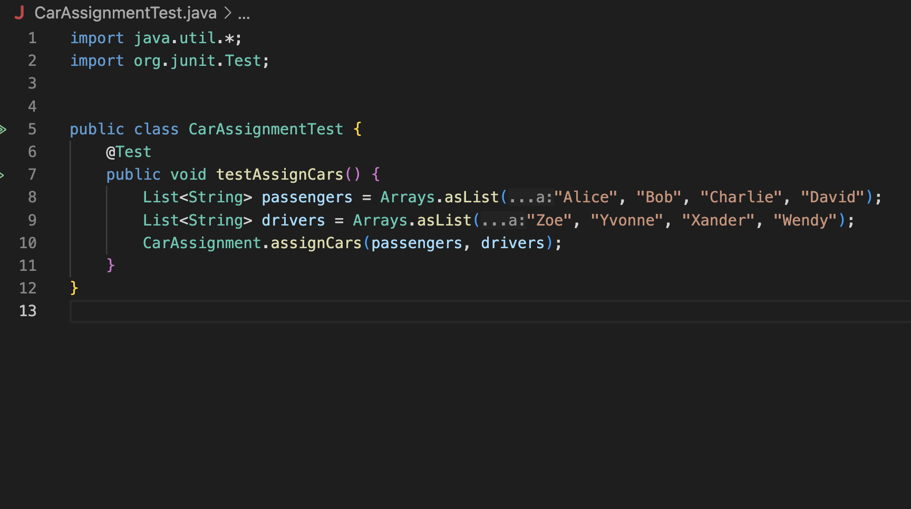
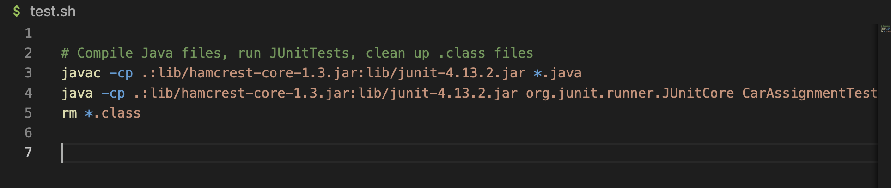
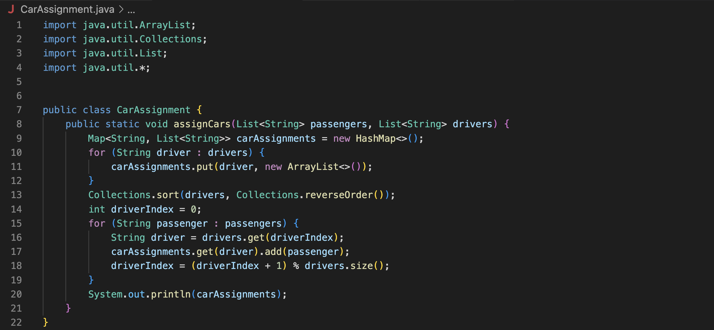

# Part 1
### The student's description of a guess at the bug/some sense of what the failure-inducing input is:

Hi,
I'm running into an error on my file. I wrote the implmentation of `CarAssignment.java` and assigned each `passenger` a `driver`. But when I ran `bash test.sh` `<enter>`, the terminal gave me the error `java.lang.UnsupportedOperationException`.
I'm not sure what could have triggered this error. I think it could be the changes to `drivers` but I'm not sure. I attached pictures of the error message and my implementation of `CarAssignment.java`.

### The post from the student with a screenshot showing a symptom:




### A response from a TA asking a leading question or suggesting a command to try:

Hi there!
It looks like your error is from the `remove` occurring. Have you considered that you might be trying to modify something without the ability to `remove`?
Try using another way that doesn't involve `remove` and see if the error occurs.

### Another screenshot/terminal output showing what information the student got from trying that:

Student:
Thanks! I took out the `remove` method and it works now. I used `driverIndex` instead. There's a picture of my changes and my test case passing


### A clear description of what the bug is:
It looks like the bug was from using `remove` on `drivers`. Since `drivers` was created from `Arrays.asList()` in the test file `CarAssignmentTest.java`, it was a fixed-size `List` that did not support the `remove` method. To avoid this issue, it was necessary to create a new variable to track current `driver`, rather than modify `drivers` with the `remove` method.


# Part 1 Setup
Setup: A program that takes two `String` `Lists`, `passengers` and `drivers`.
Each `passenger` gets a `driver`.

The file & directory structure needed

### The contents of `CarAssignment.java` before fixing the bug (code block and screenshot of code block)
```
import java.util.ArrayList;
import java.util.Collections;
import java.util.List;
import java.util.*;

public class CarAssignment {
    public static void assignCars(List<String> passengers, List<String> drivers) {
        Map<String, List<String>> carAssignments = new HashMap<>();
        for (String driver : drivers) {
            carAssignments.put(driver, new ArrayList<>());
        }
        Collections.sort(drivers, Collections.reverseOrder());
        for (String passenger : passengers) {
            String driver = drivers.get(0);
            carAssignments.get(driver).add(passenger);
            drivers.remove(0);
            drivers.add(driver);
        }
        System.out.println(carAssignments);
    }
}
```

### The contents of `CarAssignmentTest.java` before fixing the bug (code block and screenshot of code block)
```
import java.util.*;
import org.junit.Test;

public class CarAssignmentTest {
    @Test
    public void testAssignCars() {
        List<String> passengers = Arrays.asList("Alice", "Bob", "Charlie", "David");
        List<String> drivers = Arrays.asList("Zoe", "Yvonne", "Xander", "Wendy");
        CarAssignment.assignCars(passengers, drivers);
    }
}
```


### The contents of `test.sh` before fixing the bug (code block and screenshot of code block)
```
# Compile Java files, run JUnitTests, clean up .class files
javac -cp .:lib/hamcrest-core-1.3.jar:lib/junit-4.13.2.jar *.java
java -cp .:lib/hamcrest-core-1.3.jar:lib/junit-4.13.2.jar org.junit.runner.JUnitCore CarAssignmentTest
rm *.class
```



### The full command line (or lines) you ran to trigger the bug: I typed `bash test.sh` `<enter>` (code block and screenshot of code block)
```
(base) administrator@Administrators-MacBook-Pro ed_stem_lab5 copy % bash test.sh
```


### The change that fixes the bug (code block and screenshot of code block):
```
import java.util.ArrayList;
import java.util.Collections;
import java.util.List;
import java.util.*;

public class CarAssignment {
    public static void assignCars(List<String> passengers, List<String> drivers) {
        Map<String, List<String>> carAssignments = new HashMap<>();
        for (String driver : drivers) {
            carAssignments.put(driver, new ArrayList<>());
        }
        Collections.sort(drivers, Collections.reverseOrder());
        int driverIndex = 0;
        for (String passenger : passengers) {
            String driver = drivers.get(driverIndex);
            carAssignments.get(driver).add(passenger);
            driverIndex = (driverIndex + 1) % drivers.size();
        }
        System.out.println(carAssignments);
    }
}
```


### A description of what to edit to fix the bug:
- The error was caused by an attempt to modify a `List` that is does not allow modification. 
- Instead of attempting to `remove` from the list, it uses `driverIndex` to track which `driver` should be assigned to the `passenger`.
- Since the `drivers` list is not modified in the process, it does not produce the `java.lang.UnsupportedOperationException`. 


# Part 2
### In a couple of sentences, describe something you learned from your lab experience in the second half of this quarter that you didn’t know before. 

This quarter, I learned how to use `jdb`. I've never used `jdb` to debug through `vim` before. This is useful for remote servers.
I worked a lot with other people's code, like in last week where I had to give feedback on their code. I liked the suggested structure on how to evaluate code and how give feedback politely. I also got a lot of experience using the shell scripts. Before this class, I'd never used `test.sh` or similar files to run my tests. I would type everything in the terminal instead.
