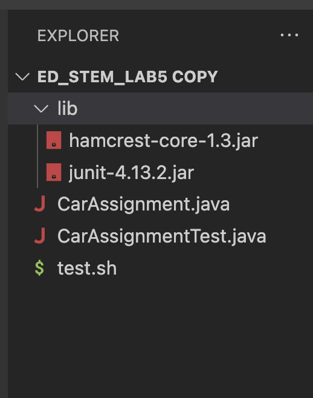

# Context

The file & directory structure needed


The contents of `CarAssignment.java` before fixing the bug
```
import java.util.ArrayList;
import java.util.Collections;
import java.util.List;
import java.util.*;

public class CarAssignment {
    public static void assignCars(List<String> passengers, List<String> drivers) {
        Map<String, List<String>> carAssignments = new HashMap<>();
        for (String driver : drivers) {
            carAssignments.put(driver, new ArrayList<>());
        }
        Collections.sort(drivers, Collections.reverseOrder());
        for (String passenger : passengers) {
            String driver = drivers.get(0);
            carAssignments.get(driver).add(passenger);
            drivers.remove(0);
            drivers.add(driver);
        }
        System.out.println(carAssignments);
    }
}
```


The contents of `CarAssignmentTest.java` before fixing the bug

```
# Compile Java files, run JUnitTests, clean up .class files
javac -cp .:lib/hamcrest-core-1.3.jar:lib/junit-4.13.2.jar *.java
java -cp .:lib/hamcrest-core-1.3.jar:lib/junit-4.13.2.jar org.junit.runner.JUnitCore CarAssignmentTest
rm *.class

```


```
# Compile Java files, run JUnitTests, clean up .class files
javac -cp .:lib/hamcrest-core-1.3.jar:lib/junit-4.13.2.jar *.java
java -cp .:lib/hamcrest-core-1.3.jar:lib/junit-4.13.2.jar org.junit.runner.JUnitCore CarAssignmentTest
rm *.class
```
The contents of `test.sh` before fixing the bug


The full command line (or lines) you ran to trigger the bug
```
(base) administrator@Administrators-MacBook-Pro ed_stem_lab5 copy % bash test.sh
```

A description of what to edit to fix the bug


You should actually set up and run the scenario from your screenshots. 


# Part 1
The original post from a student with a screenshot showing a symptom:

The student's description of a guess at the bug/some sense of what the failure-inducing input is. 


A response from a TA asking a leading question or suggesting a command to try:


Another screenshot/terminal output showing what information the student got from trying that, and a clear description of what the bug is.


# Part 2
In a couple of sentences, describe something you learned from your lab experience in the second half of this quarter that you didn’t know before. 
It could be a technical topic we addressed specifically, something cool you found out on your own building on labs, something you learned from a tutor or classmate, and so on. 
It doesn’t have to be specifically related to a lab writeup, we just want to hear about cool things you learned!
